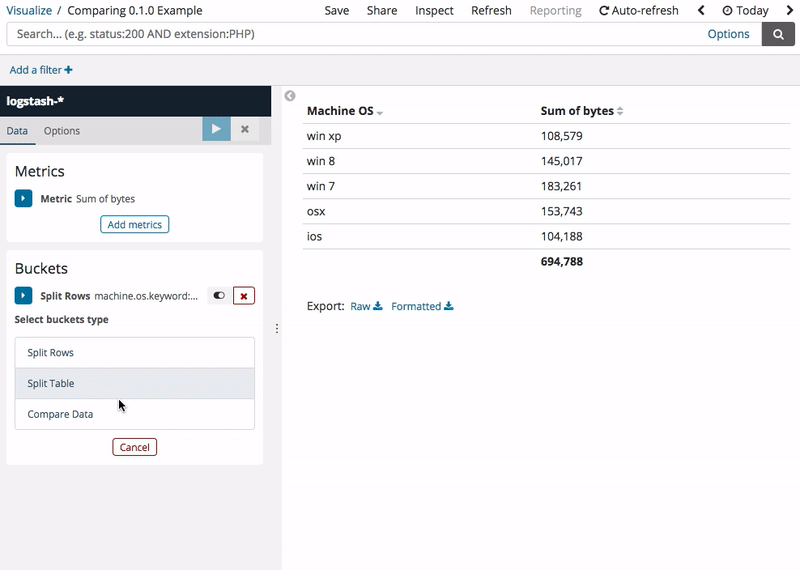

[](https://www.belugadb.com)

# Comparable Time Range Plugin for Kibana
> Comparable time range offset feature for Kibana table. Compare your data to previous day, week or month. :calendar:

## Example Usage: Today vs. Previous Day


## Installation
This plugin is currently under development and it has been tested in Kibana `6.1.1` version only.
To install, run this command from your Kibana project folder:
```
./bin/kibana-plugin install https://github.com/belugadb/kibana-comparable-time-range/releases/download/v0.0.4/comparable_time_range-0.0.4.zip
```

You can also install previous versions of this plugin. Check the [repository releases](https://github.com/belugadb/kibana-comparable-time-range/releases).

## Development

See the [kibana contributing guide](https://github.com/elastic/kibana/blob/master/CONTRIBUTING.md) for instructions setting up your development environment. Once you have completed that, use the following yarn scripts.

  - `yarn kbn bootstrap`

    Install dependencies and crosslink Kibana and all projects/plugins.

    > ***IMPORTANT:*** Use this script instead of `yarn` to install dependencies when switching branches, and re-run it whenever your dependencies change.

  - `yarn start`

    Start kibana and have it include this plugin. You can pass any arguments that you would normally send to `bin/kibana`

      ```
      yarn start --elasticsearch.url http://localhost:9220
      ```

  - `yarn build`

    Build a distributable archive of your plugin.

  - `yarn test:browser`

    Run the browser tests in a real web browser.

  - `yarn test:server`

    Run the server tests using mocha.

For more information about any of these commands run `yarn ${task} --help`. For a full list of tasks checkout the `package.json` file, or run `yarn run`.

## License

This software is licensed under the Apache License, version 2 ("ALv2"), quoted below.

Copyright 2018 BelugaDB <https://www.belugadb.com>

Licensed under the Apache License, Version 2.0 (the "License"); you may not
use this file except in compliance with the License. You may obtain a copy of
the License at

    http://www.apache.org/licenses/LICENSE-2.0

Unless required by applicable law or agreed to in writing, software
distributed under the License is distributed on an "AS IS" BASIS, WITHOUT
WARRANTIES OR CONDITIONS OF ANY KIND, either express or implied. See the
License for the specific language governing permissions and limitations under
the License.
